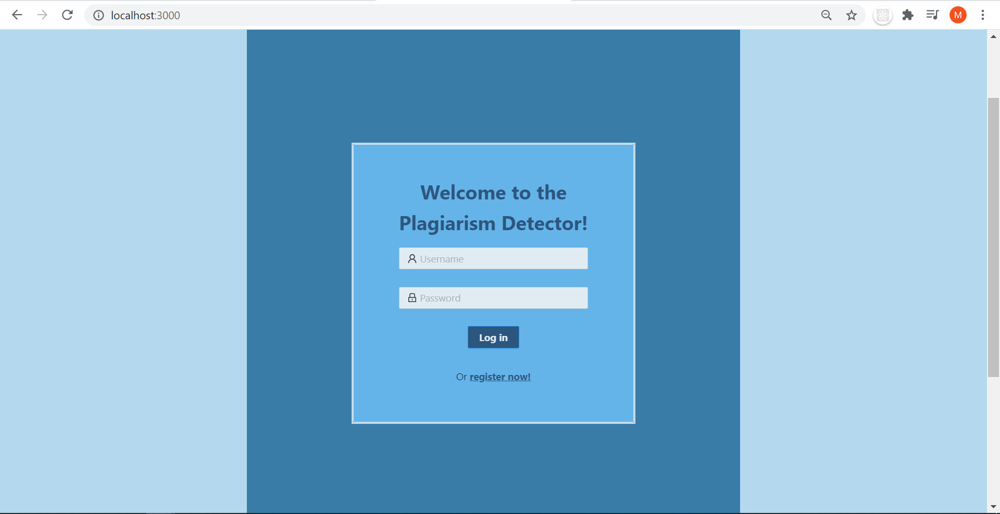
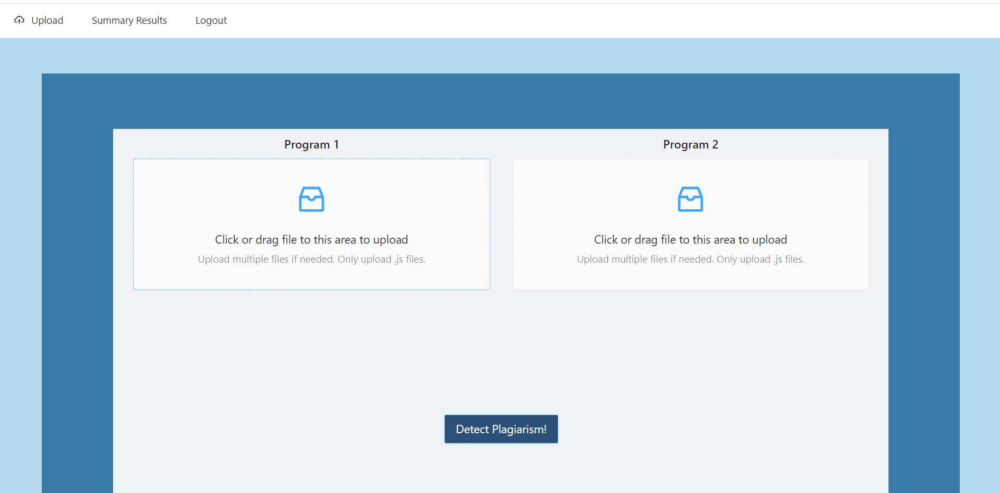
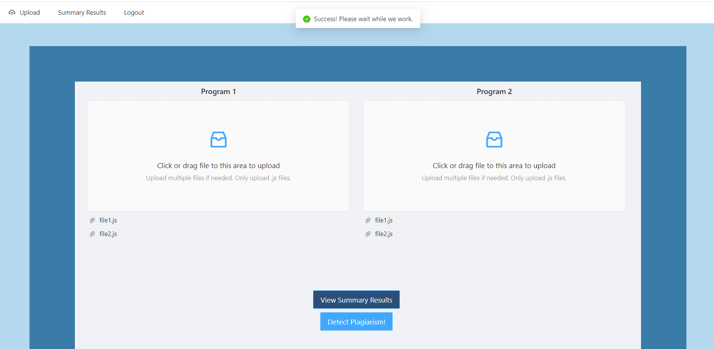
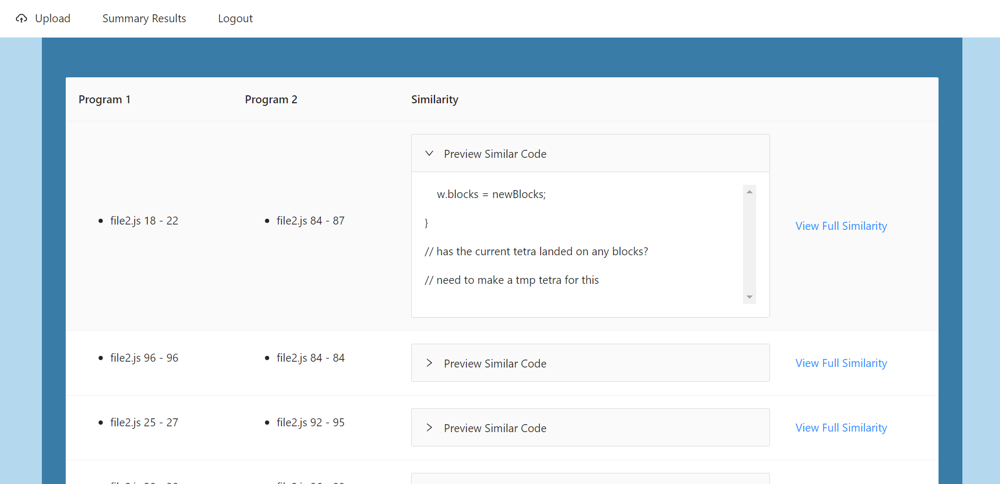
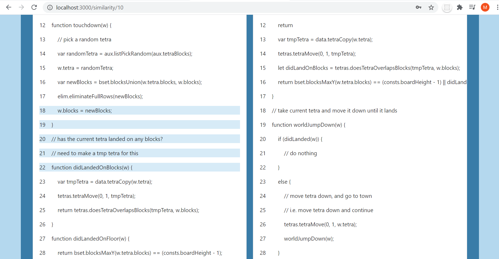
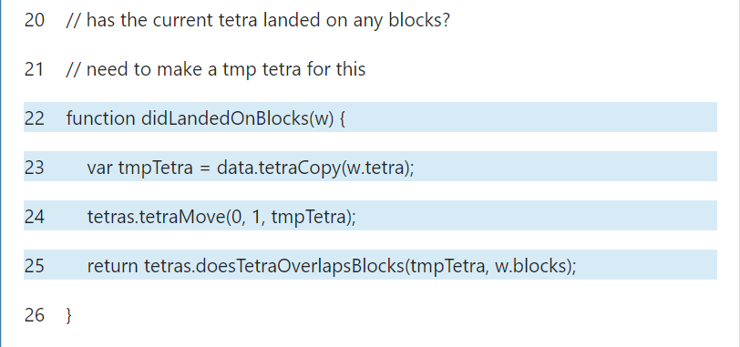
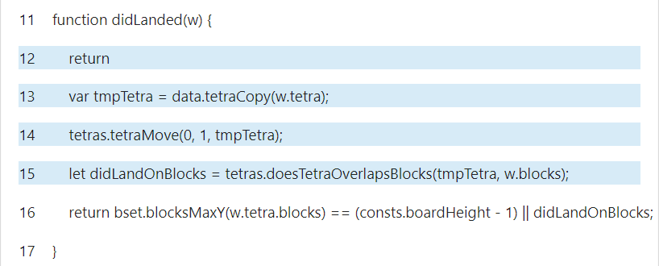

# Plagiarism Detector (CS5500, Northeastern University)
## Collaborators: 
Eiki Kan, Lisa Lam, Robert (Bobby) Lupo

# Note on project code availability:
**The instructors for this course have advised students to refrain from sharing their coursework freely as they may decide to reuse this project for future iterations of the course**. Following this, this repository will share the results of the work and a summarization of the project and the development process, but not the project itself.

## Summary
As part of the coursework for CS5500: Foundations of Software Engineering, my teammates and I applied what we learned about TypeScript, Agile methodology, various software development life cycles (SDLC), test-driven development, etc. to a semester-long project: a plagiarism detector for any language of our choosing. The project was required to be implemented in TypeScript and make use of either the [MaterialUI](https://material-ui.com/) or [Ant Design](https://ant.design/) front-end frameworks. Another requirement is for our detector to be able to handle plagiarism-detection avoidance techniques such as changing variable names, moving code in or out of functions, rearranging code, changing comments, etc. 

### Project Screenshots
#### Login

#### File upload utilizing Express file module

#### After running plagiarism detection, viewing the similarities

#### Example: was able to detect a function that returned early, probably as a filler to confuse a detector that would compare line by line or by text difference

### Process
Using the Agile methodology of software development, we met regularly to conduct plagiarism detection research, determine what use cases we thought we could implement in the given timeframe, and implement and integrate work that was done both individually and in pairs/groups. We informally split our team of four into a front-end team and a back-end team, communicated the features expected from either end, and collaborated to combine our parts into a cohesive application. At the end of the semester, we presented a working demonstration of our project to the class and instructors and submitted a final report.

### Learning
None of us were familiar with TypeScript, though altogether, we had combined experience with web development, database management, mobile application development, and other areas. **At the end of this project, we were more familiar with TypeScript, JavaScript, and React, which we used to implement our project. We also used [Lucidchart](https://lucid.co/) and [Figma](https://www.figma.com/) to diagram and prototype our project as part of the design process**. Additionally, we learned more about SDLCs by applying the Agile methodology to our working process and we learned about creating and using REST API endpoints.

## Future Endeavors
### Plagiarism Detection 
The algorithm we used was heuristic and we definitely noticed this when we were testing our application using a multi-file submission. There were <em>no</em> similarities found in one of the files! The paper we used to implement our algorithm suggests an improved version of it (involving hashing and reduced algorithmic time complexity!), which is a possible avenue for project expansion.

### Feature Engineering
Other possible avenues of improvement involve hosting the project on the web, connecting a database for persistent storage of the results conducted, allowing for user manipulation (i.e. tracking manual review of the suspect code), etc. 
